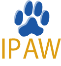

The International Provenance and Annotation Workshop (IPAW) is biannual workshop that is concerned with issues of data provenance, data derivation, and data annotation. It brings together computer scientists from different areas and provenance users to discuss open problems related to the provenance of computation and non-computational artifacts.

The proceedings for IPAW have been published by Springer since 2008. You can find them here: [https://link.springer.com/conference/ipaw]( https://link.springer.com/conference/ipaw)

* [IPAW'20, Charlotte, North Carolina](https://iitdbgroup.github.io/ProvenanceWeek2020/ipaw.html)
* [IPAW'18, London, UK](http://provenanceweek2018.org)
* [IPAW'16, McLean, Virginia, USA](http://www2.mitre.org/public/provenance2016/index.html)
* [IPAW'14, Cologne, Germany](https://provenanceweek.dlr.de/ipaw)
* [IPAW'12, Santa-Barbara, California](http://ipaw2012.bren.ucsb.edu)
* [IPAW'10, Troy, New-York](http://tw.rpi.edu/portal/IPAW2010)
* [IPAW'08, Salt-Lake City, Utah](http://www.sci.utah.edu/ipaw2008/index.html)
* [IPAW'06, Chicago, Illinois](http://www.ipaw.info/ipaw06/index.html)
* [Data Provenance and Annotation 2003, Edinburgh, Scotland](http://www.nesc.ac.uk/esi/events/304/)
* [Workshop on Data Derivation and Provenance 2002, Chicago, Illinois](http://www.ipaw.info/chicago02/position_papers.html)
 

### The IPAW Steering Committee

The IPAW Steering Committee consists of previous organizers of the IPAW workshop.

* Khalid Belhajjame - University Paris-Dauphine
* Ashish Gehani - SRI International
* Marta Mattoso - Federal University Rio de Janeiro
* Boris Glavic - Illinois Institute of Technology
* Adriane Chapman - University of Southampton
* Andreas Schreiber - DLR
* Juliana Freire	- Polytechnic Institute of New York University
* James Frew	- University of California, Santa Barbara
* Paul Groth (chair)	- University of Amsterdam
* Bertram Ludaescher	- University of Illinois at Urbana-Champaign
* Deborah McGuinness	- Rensselaer Polytechnic Institute
* Beth Plale	- Indiana University Bloomington

Past Board Members
* Luc Moreau (emeritus chair)	University of Southampton
* Ian Foster	-The University of Chicago
